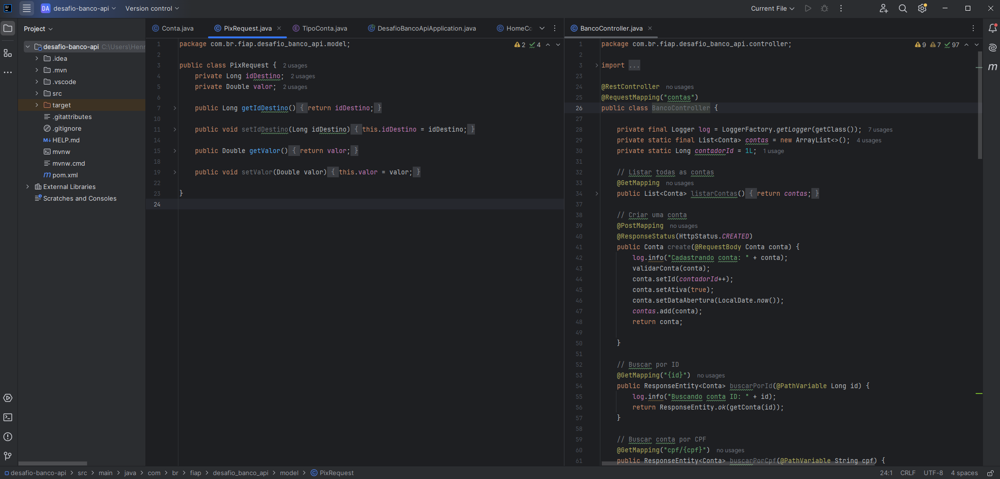

# Projeto-Jogo-21

**Código**: Código rodando.

## Descritivo:

Este projeto feito em Java teve como objetivo, criar uma plataforma para representar um banco.
Nele temos 3 tipos de contas, corrente, poupança e salário, onde o cliente faz cadastro, saque, deposito e uso de PIX.

Durante o desenvolvimento do projeto, fui orientado pelo professor João de Java-Advanced na FIAP.

## Tecnologias:

**Técnicos**: Java 8, Spring Boot, Spring Web, Estrutura MVC, POO, Manipulação de Exceções e Respostas HTTP.
